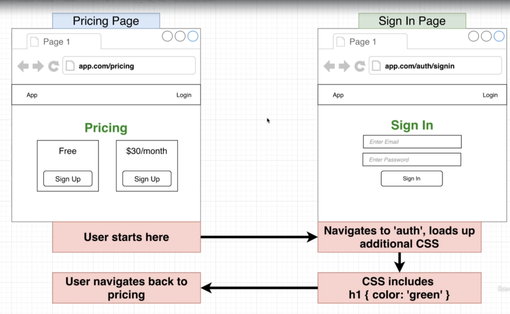
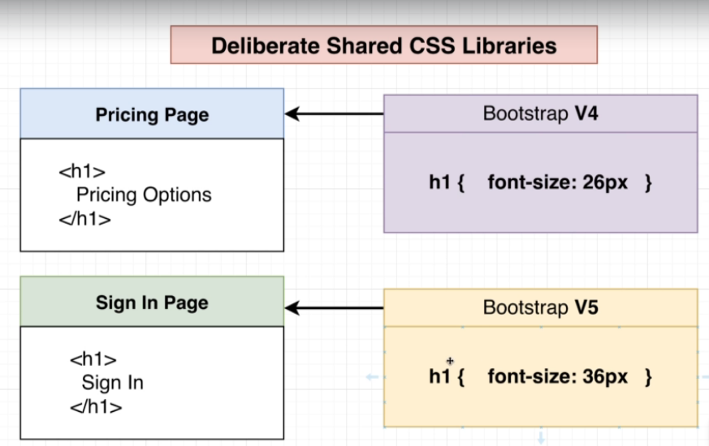
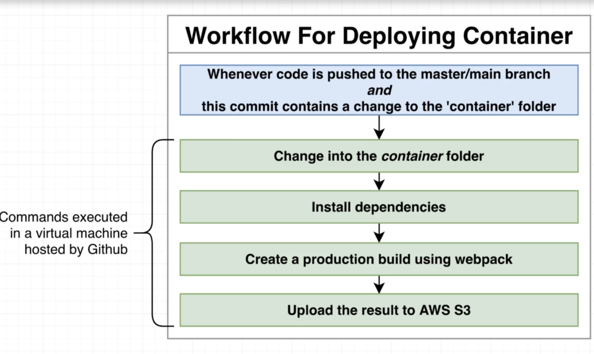
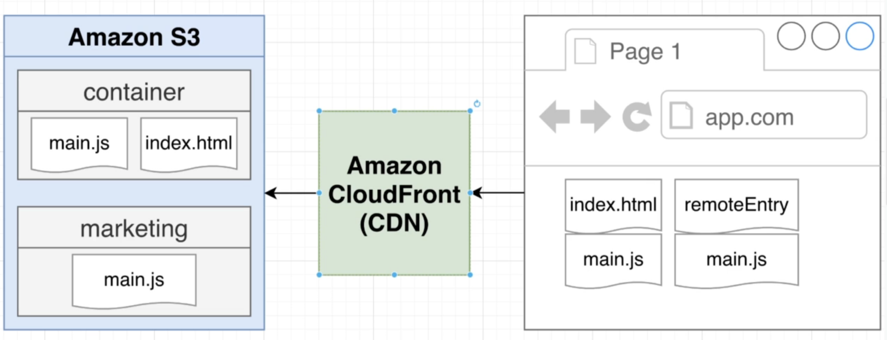

# Microfrontends

Notes and experiments on Microfrontends.

- [Microfrontends](#microfrontends)
  - [What are microfrontends?](#what-are-microfrontends)
  - [Demos](#demos)
  - [Advantages](#advantages)
  - [Requirements](#requirements)
  - [Integration](#integration)
    - [Compile-Time Integration](#compile-time-integration)
      - [Tradeoffs](#tradeoffs)
    - [Run-Time Integration](#run-time-integration)
      - [Tradeoffs](#tradeoffs-1)
    - [Server Integration](#server-integration)
  - [Technical Details](#technical-details)
    - [Module Federation](#module-federation)
    - [Federation Plugin](#federation-plugin)
    - [Sharing CSS](#sharing-css)
      - [Problem: Style collisions](#problem-style-collisions)
      - [Problem: Sharing style libraries](#problem-sharing-style-libraries)
      - [Solutions](#solutions)
    - [Infrastructure & CI/CD](#infrastructure--cicd)

## What are microfrontends?

* Divide a _monolithic_ app into multiple, smaller, more manageable parts.
* Each part is responsible for a distinct feature.

## Demos

1. [Simple module federation: products + cart](ecommerce-demo)
2. [Microfrontends: 4 apps w/different tech stacks](mfp-demo)

## Advantages

* __Velocity__
  * Feature teams con work in isolation.
  * Each smaller part is easier to understand and make changes to.
* __Time to Market__: Features can be delivered isolately.
* __Ownership__: Enforces a clear separation of responsibilities.

## Requirements

1. Zero coupling between child projects.
   1. No importing of functions/objects/classes/etc.
   2. No shared state.
   3. Shared libraries through MF is ok.
2. Near-zero coupling between container and child apps.
   1. Container shouldn't assume that a child is using a particular framework.
   2. Any necessary communication is done with callbacks or simple events.
3. CSS from one project shouldn't affect another.
4. Version control (monorepo vs separate) shouldn't have any impact on the overall project.
5. Container should be able to decide to always use the latest version of a microfrontend _or_ specifiy version.

## Integration

### Compile-Time Integration

__Before__ container gets loaded in the browser, it gets access to components source code.

1. Engineering team develops the component.
2. Time to deploy! Publish the component as an NPM package.
3. Container team installs the component as a dependency.
4. Container team builds their app.
5. Output bundle that includes all the code for the component.

#### Tradeoffs

* :+1: Easy to setup & understand.
* :-1: Container has to be re-deployed every time component is updated.
* :-1: Tempting to tightly couple the container & component together.

### Run-Time Integration

__After__ container gets loaded in the browser, it gets access to components source code.

> _Webpack Module Federation_ is an example. 

1. Engineering team develops the component.
2. Time to deploy! Code deployed at `myapp.com/components/component.js`.
3. User navigates to `myapp.com` , Container app is loaded.
4. Container app fetches `component.js` and executes it.

#### Tradeoffs

* :+1: Component can be deployed independently at any time.
* :+1: Different versions of the component can be deployed and the Container can decide which one to use.
* :-1: Tooling + setup is far more complicated.

### Server Integration

While sending down JS to load up the container, a server decides whether or not to include components source code.

## Technical Details

### Module Federation

> Read more in [dev.to: Webpack 5 and Module Federation](https://dev.to/marais/webpack-5-and-module-federation-4j1i).

Module Federation aims to solve the sharing of modules in a distributed system, by shipping those critical shared pieces as macro or as micro as you would like. It does this by pulling them out of the the build pipeline and out of your apps.

* __Host__: A host is an artifact that can be loaded cold. Typically, the one that usually initializes from the window.onload event. A host app contains all the typical features from a SPA, or SSR app. It loads all the initial chunks, boots the app and renders what the user will see first.

* __Remote__: A remote can both be a host or strictly a remote. A remote's job is to offer up, or rather expose modules that can be consumed by other Host's and Remote's. You can also opt this remote into having some (or all) of its dependencies shared in the sense of; if the host already has react, just send it into this runtime, allowing the remote to not have to download its own copy of react.

1. Designate one app as the _Host_ (i.e., _Container_) and one as the _Remote_.
2. In the _Remote_, decide which modules (files) you want to make available to other proejcts.
3. Set up Module Federation plugin to expose those files.
4. In the _Host_, decide which files you want to get from the remote.
5. Set up Module Federation plugin to fetch those files.
6. In the _Host_, refactor the entry point to load asynchronously.
7. In the _Host_, import whatever files you need from the remote.

### Federation Plugin

Loading in a remote will only download the code needed to power that component, and NONE of the shared modules.

What this will allow you to do in practice is have each one of your MFE's expose its route-map, typically the component fragment that you'd give to `react-router`.

### Sharing CSS

#### Problem: Style collisions

#### Problem: Sharing style libraries

#### Solutions

1. Custom CSS:
   1. Use CSS-in-JS library.
   2. Use built-in framewrok component style scoping.
   3. Use namespaces for all your CSS.
2. CSS from a library:
   1. Use a component librar that doess css-in-js (e.g., MaterialUI, styled-components).
   2. Manually build the CSS library and apply namespacing techniques to it.

### Infrastructure & CI/CD

